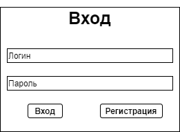
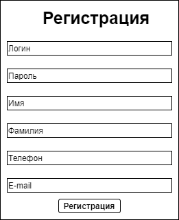
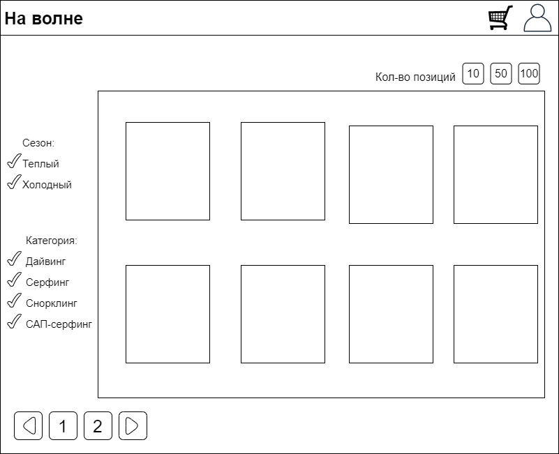
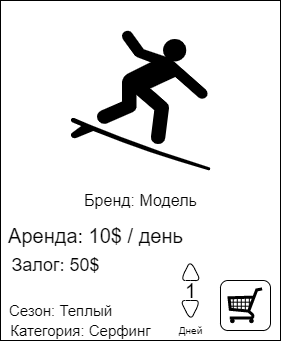
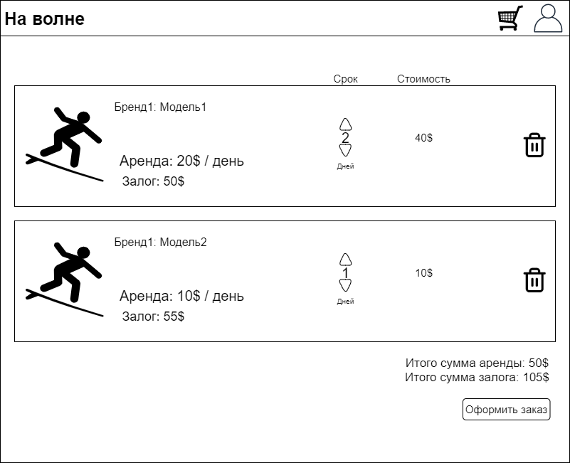
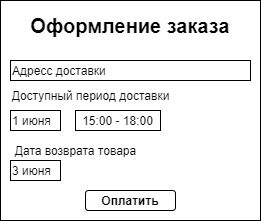
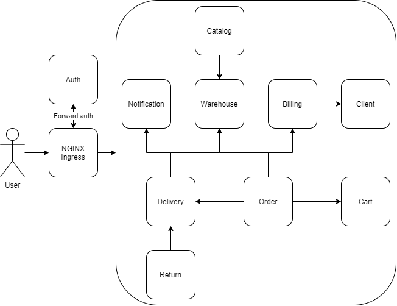

# Homework №8 Sergey Chachanagov
# Описание приложения для аренды инвентаря для водных развлечений "На волне"
## Пользовательские сценарии

1. Пользователь может иметь свой аккаунт и возможность в него зайти

2. Если пользователь уже зарегистрирован, то он может войти в аккаунт. В противном случае он имеет возможность зарегистрироваться.

3. Пользователь заходит на страницу со списком товаром. Ему доступно управление размером одной страницы с товарами, а также фильтрация.

4. На карточке товара пользователь видит следующую информацию:

5. Далее пользователь выбирает период и нажимает на кнопку "Заказать" и товар попадает в корзину. Пользователь может зайти на страницу корзины, просмотреть выбранные им товары, еще раз настроить сроки аренды.

6.  Пользователь нажимает кнопку "Оформить" и попадает на форму.

7. Далее пользователь оплачивает заказ.

8. В сервисе создается соответствующий заказ. 
   Пользователю приходит уведомление. 
   На складе резервируется товар. 
   В сервис доставки отправляется запрос на доставку товара.

## Общая схема взаимодействия сервисов

## Назначение сервисов и зона ответственности

## Сервис "Аутентификация"

**Назначение:**
Авторизация и аутентификация пользователей.

**Зона ответственности:**
Управляет сессиями пользователей. Позволяет регистрировать пользователя.

### Запросы
- GET: /api/auth/sessions
  Возвращает список актуальных сессий.

- GET: /api/auth/signin
  Возвращает сообщение-редирект к логину.

### Команды
- POST: /api/auth/register
  Создает клиента.

- POST: /api/auth/login
  Создает клиентскую сессию. Кладет sessionId в cookie.

- POST: /api/auth/logout
  Удаляет клиентскую сессию. Удаляет sessionId из cookie.

- ANY: /api/auth/auth
  Производит аутентификацию по sessionId. Возвращает clientId в хэдере.

## Сервис "Клиент"

**Назначение:**
Управление информацией о клиентах.

**Зона ответственности:**
Предоставляет информацию о клиенте, изменяет инфо о клиенте, удаляет клиентов.

### Запросы
- GET: /api/client/me
  Возвращает информацию о клиенте, который делает запрос.

- GET: /api/client/{clientId}
  Возвращает информацию о клиенте по ID.

### Команды
- PUT: /api/client/me
  Обновляет инфо о клиенте, который делает запрос.

- PUT: /api/client/{clientId}
  Обновляет инфо о клиенте по ID.

- DELETE: /api/client/{clientId}
  Удаляет клиента по ID.

## Сервис "Биллинг"

**Назначение:**
Управление лицевым счетом клиента.

**Зона ответственности:**
Пополняет баланс клиента, списывает деньги.

### Запросы
- GET: /api/account/{clientId}
  Возвращает текущий баланс клиента.

### Команды
- POST: /api/account/{clientId}
  Создание денежного аккаунта для клиента.

- PUT: /api/account/balance/{clientId}/?sum=
  Пополняет баланс клиента.

- POST: /api/account/balance/{clientId}/?sum=
  Вычитает деньги с баланса клиента по ID.

- POST: /api/account/balance/?sum=...;clientPhoneNumber=
  Вычитает деньги с баланса клиента по номеру телефона.

## Сервис "Корзина"

**Назначение:**
Управление корзиной клиента.

**Зона ответственности:**
Хранит выбранные клиентом позиции, предоставляет доступ к позициям в корзине клиента.

### Запросы
- GET: /api/cart
  Возвращает список позиций, занесенных в корзину, по sessionId.

### Команды
- POST: /api/cart
  Создает/Обновляет список позиций в корзине, по sessionId.

- DELETE: /api/cart
  Очищает список позиций в корзине, по sessionId.

## Сервис "Каталог"

**Назначение:**
Управление каталогом доступных товаров.

**Зона ответственности:**
Предоставляет доступ к позициям в каталоге, имея функции пагинации, фильтрации и сортировки.

### Запросы
- GET: /api/catalog/position/?page=..;size=..;name=..
  Возвращает страницу с позициями каталога.

- GET: /api/catalog/position/season/?page=..;size=..;sortColumn=..;sortDirection=..;seasonType=..
  Возвращает страницу с позициями каталога, отфильтрованными по сезону.

- GET: /api/catalog/position/category/?page=..;size=..;sortColumn=..;sortDirection=..;equipmentCategory=..
  Возвращает страницу с позициями каталога, отфильтрованными по категории.

### Команды
- POST: /api/catalog/admin/update
  Обновить каталог товарами со склада.

## Сервис "Доставка"

**Назначение:**
Управление доставками товаров клиентам.

**Зона ответственности:**
Управляет статусами доставок, назначает курьеров на доставку и возврат товара, резервирует товары на складе.

### Запросы
- GET: /api/delivery/couriers
  Возвращает список всех курьеров.

- GET: /api/delivery/{courierId}
  Возвращает список всех доставок курьера.

### Команды
- PUT: /api/delivery/{deliveryId}/?status=
  Обновляет статус доставки.

- POST: /api/delivery/return
  Инициирует возврат товара.
  
### События

- Отправка уведомления об назначении доставки товара в сервис Уведомлений.
- Прием события о создании нового заказа.

## Сервис "Уведомление"

**Назначение:**
Управление уведомлениями.

**Зона ответственности:**
Получает и хранит уведомления, отправленные клиенту.

### Запросы
- GET: /api/notification
  Получение всех накопленных уведомлений.

## Сервис "Заказ"

**Назначение:**
Управление заказами.

**Зона ответственности:**
Создать заказ, зарезервировать товары на складе, очистить корзину, провести процедуру оплаты заказа.

### Команды
- POST: /api/order/place
  Разместить новый заказ.

- POST: /api/order/status
  Изменить статус заказа.

### События

- Отправка уведомления о создании нового заказа в сервис Уведомлений.

## Сервис "Возврат"

**Назначение:**
Управление возвратом товаров.

**Зона ответственности:**
Регулярная проверка товаров на окончание срока аренды и инициация возврата с помощью службы Доставки.

## Сервис "Склад"

**Назначение:**
Управление списком товаров на складе.

**Зона ответственности:**
Добавление товаров на склад, резервирование товаров на складе, предоставление информации о наполнении склада.

### Запросы
- GET: /api/brand
  Возвращает список всех брендов.

- GET: /api/equipment/balance
  Возвращает список артиклей товаров и их доступное количество на складе.

- GET: /api/model
  Возвращает список всех моделей.

- GET: /api/model/{brandCode}
  Возвращает список всех моделей определенного бренда.

### Команды
- POST: /api/booking/book
  Бронь товара на складе.

- POST: /api/booking/unbook/{customerPhoneNumber}
  Снятие брони с товара на складе.

- POST: /api/brand
  Добавление бренда в БД.

- POST: /api/equipment
  Добавление единиц товара на склад.

- PUT: /api/equipment/?customerPhone=...;newStatus=..
  Изменение статуса товаров, которые зарезервированы за покупателем, на складе.

- PUT: /api/equipment/{inventoryNumber}/?newStatus=..
  Изменение статуса единицы товара на складе.

- POST: /api/model
  Добавить новую модель